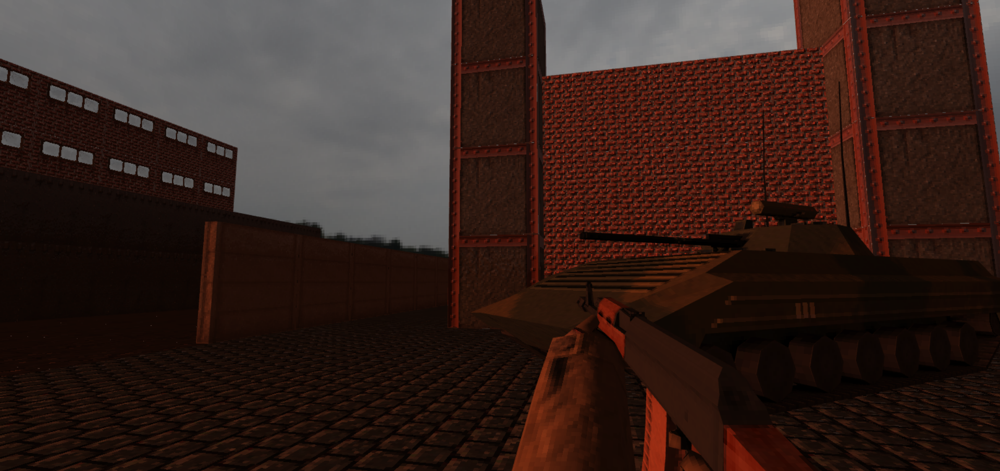
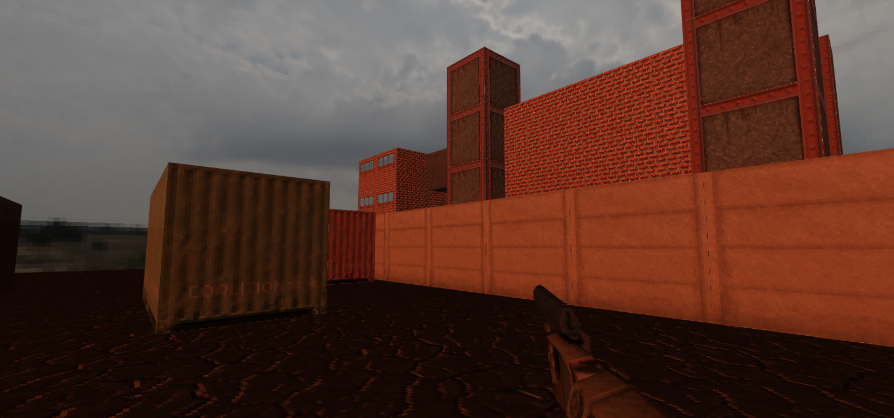

# WebGL Boxes

[Live Demo](https://webgl-boxes.netlify.app/)

## Things missing

- collisions (so simple to implement that I didn't bother doing it, convex-hull in a future projects),
- shadow mapping (quite hard to get right),
- skinning (will have to extend current GLTF importer to load them)

## Things to reconsider

- shaders definition - probably a unified 'shader interface' for all materials is a way to go
- WebGL2 - it's widely available nowadays, itegrates alot of extensions from WebGL1 into the core

szym.mie 2022
